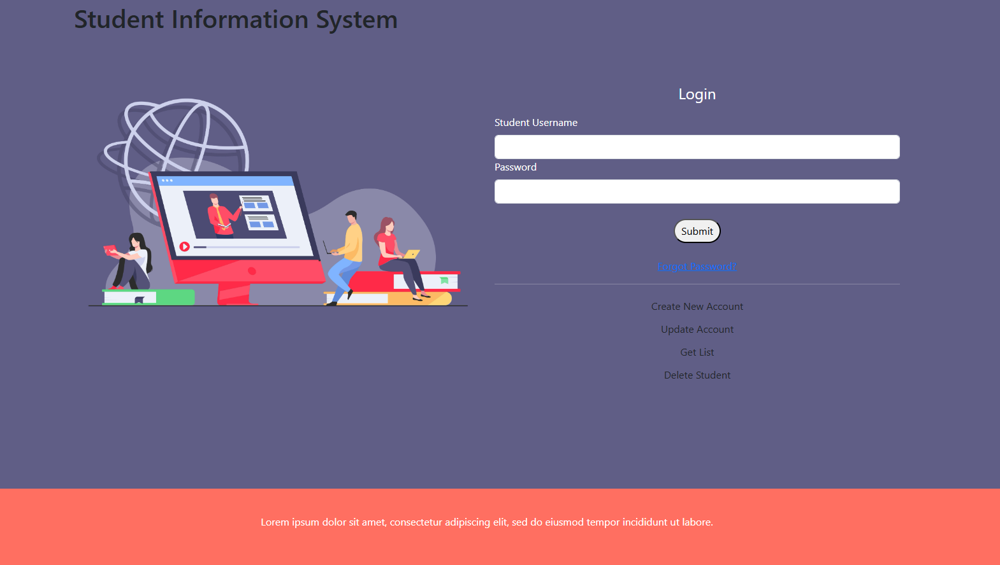

# ASP.NET Core Web API - Student Information System

This project is a simple ASP.NET Core Web API designed to manage a student information system. The system allows CRUD operations on student data and implements both server-side and client-side validation.

## Screenshot


## Objectives

- Develop a .NET Core Web API for managing student information.
- Implement CRUD (Create, Read, Update, Delete) operations.
- Ensure data validation on both the server and client sides.
- Build HTML forms for creating and updating student records and integrate them with the Web API.

## Features

### Student Model

The `Student` class represents the structure of a student:

```csharp
public class Student
{
    public int Id { get; set; }          // Unique student ID
    public string FirstName { get; set; } // First name of the student
    public string LastName { get; set; }  // Last name of the student
    public string Grade { get; set; }     // Grade or class of the student
}
```

### API Endpoints

1. **Get All Students**
   - **HTTP Method**: GET
   - **Endpoint**: `/api/students`
   - **Produces**: JSON
   - **Response**: Returns the list of all students.

2. **Get Student by ID**
   - **HTTP Method**: GET
   - **Endpoint**: `/api/students/{id}`
   - **Produces**: JSON
   - **Response**:
     - 200 OK: Returns the student details.
     - 404 Not Found: If the student is not found.

3. **Create a Student**
   - **HTTP Method**: POST
   - **Endpoint**: `/api/students`
   - **Consumes**: JSON
   - **Produces**: JSON
   - **Response**:
     - 201 Created: If the student is successfully created.
     - 400 Bad Request: If required fields are missing or invalid.

4. **Update a Student**
   - **HTTP Method**: PUT
   - **Endpoint**: `/api/students/{id}`
   - **Consumes**: JSON
   - **Produces**: JSON
   - **Response**:
     - 200 OK: If the student is successfully updated.
     - 400 Bad Request: If required fields are missing or invalid.

5. **Delete a Student**
   - **HTTP Method**: DELETE
   - **Endpoint**: `/api/students/{id}`
   - **Produces**: JSON
   - **Response**:
     - 200 OK: If the student is successfully deleted.
     - 404 Not Found: If the student does not exist.

### HTML Form Integration

#### Example Form

```html
<form id="studentForm" action="https://localhost:5001/api/students" method="post">
  <input type="text" id="firstName" name="FirstName" placeholder="First Name" required />
  <input type="text" id="lastName" name="LastName" placeholder="Last Name" required />
  <input type="text" id="grade" name="Grade" placeholder="Grade" required />
  <button type="submit">Add Student</button>
</form>
```

#### CRUD Operations with Fetch

- **Create (POST)**: Form submission sends data to the API.
- **Read (GET)**: Use JavaScript `fetch` to dynamically populate student data.
- **Update (PUT)**: Use a form and `fetch` PUT method to update a record.
- **Delete (DELETE)**: Use JavaScript `fetch` DELETE method to remove a student.

### Client-Side Validation

Use JavaScript to validate form fields before submission:

```javascript
document.getElementById("studentForm").addEventListener("submit", function (event) {
    if (!validateForm()) {
        event.preventDefault(); // Prevent form submission if validation fails
    }
});

function validateForm() {
    const firstName = document.getElementById("firstName").value;
    const lastName = document.getElementById("lastName").value;
    const grade = document.getElementById("grade").value;

    if (!firstName || !lastName || !grade) {
        alert("All fields are required.");
        return false;
    }

    // Additional validation logic can go here

    return true;
}
```

## Project Structure

```
Student Information System
├── Controllers/
│   └── StudentsController.cs    # Handles API endpoints
├── Models/
│   └── Student.cs               # Student model
├── Views/
│   └── HTML Forms/              # Contains HTML form files
├── wwwroot/
│   └── js/                      # JavaScript files for client-side logic
├── Program.cs                   # Entry point
├── Startup.cs                   # Configuration
└── README.md                    # Documentation
```

## Running the Project

1. Clone the repository:
   ```bash
   git clone https://github.com/username/student-info-api.git
   ```
2. Navigate to the project directory:
   ```bash
   cd student-info-api
   ```
3. Build and run the project:
   ```bash
   dotnet run
   ```
4. Open your browser and navigate to:
   ```
   http://localhost:<port>/swagger
   ```
   Replace `<port>` with the displayed port number.

5. Test the API using Swagger or integrated HTML forms.
 
